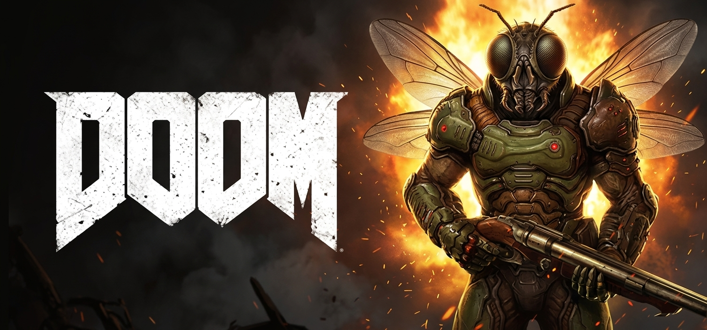
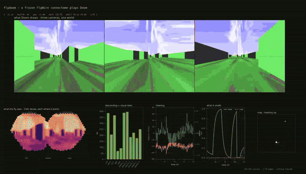

# flydoom - A fruit fly's brain plays Doom.

Not a metaphor. Scientists sliced a real fly's brain into seven thousand layers,
photographed every layer with an electron microscope, and traced all 139,255 neurons
through the stack. That wiring diagram is public. This project loads it, simulates every
neuron, shows it Doom through the fly's eyes, and reads keypresses out of the nerves that
would normally go to its legs.

**Nothing is trained.** There is no neural network being fitted, no reward, no learning of
any kind. The connections are the fly's, exactly as they were measured, and they never
change.

> 📘 **[TECHNICAL.md](TECHNICAL.md)** — the detailed version: neuron equations, cell types,
> every parameter and where it came from.
> 📊 **[RESULTS.md](RESULTS.md)** — what the experiments measured.
>
> This page is the plain-language one. No neuroscience assumed.

> **Status: built, and it produced a real result — just not the one we were aiming for.**
> Ten experiments run. The taste circuit works beautifully. The motion-vision circuit
> doesn't, and we can say precisely why. Then smell turned out to work, which nobody
> expected. It plays Doom at full speed.

---

## Watch it



Thirty seconds, real time, nothing sped up.

**Left** is the frame Doom draws. **Top right** is what the fly actually
receives — 796 hexagonal ommatidial columns per eye, sampled through the real
retinotopy, which is why it looks nothing like the screen. The arena is
repainted into blue-green because *Drosophila* R1-6 photoreceptors are nearly
blind at Doom's red primary, and Doom is painted in browns.

**Bottom right**, left to right: firing rates of the cells that would drive its
legs; the left-minus-right steering signal off `DNa02`; the two odour channels
(`ORN_DM1` vinegar = health pickups, `ORN_DA1` cVA = rivals); and a
heading-up map — the fly sits at the origin facing up, green dots are food it
can smell, red crosses are rivals.

What you are watching it do is **walk and turn**, and that is the whole list.
Read [the honest scorecard](#does-it-actually-do-anything) before reading
anything else into it. It does not aim, it never fires, and it does not seek
out health. It closes distance on enemies and on medkits at the same rate a
*random walker* does — it walks forward in a bounded map and bumps into things.

Full-quality clip: [`media/flydoom.mp4`](media/flydoom.mp4). Record your own:

```bash
.venv/bin/python scripts/record_gameplay.py --seconds 30
```

Runs headless and writes both files. `--scenario` picks the map; the default is
`deathmatch` because it has rooms and corridors to walk through. Avoid
`defend_the_center` — it is a bare circular room and the clip shows nothing.

---

## It is going to be bad at Doom

Saying so up front saves everyone time.

A frozen brain cannot learn a game it never evolved to play. What you get instead is **fly
behaviour inside Doom** — and the interesting question was never "can it finish the level."
It's *what does a real nervous system do when you drop it somewhere it has never been.*

---

## What a connectome is

A brain is neurons wired to each other. A **connectome** is the complete list of that
wiring: which neuron connects to which, and how strongly.

What you actually download is a spreadsheet. Each row says: *neuron A connects to neuron B
with N synapses, using chemical T.* A few million rows of that.

The crucial thing to understand is what this **doesn't** give you. It's a circuit diagram
printed with no component values — every wire is known, but nothing about voltages or
timing. All of that has to be supplied separately, and that gap is where essentially every
problem in this project lived.

A neuron itself is simpler than you'd think. It's a leaky bucket holding a voltage that
constantly drains back toward rest. Inputs nudge it up or down. If it climbs past a
threshold it fires a single all-or-nothing pulse to everything downstream, then resets.
That's it. We run 139,255 of those at once, stepping time forward in half-millisecond
ticks — 57 of them for every frame Doom draws, because a fly is faster than the game.

---

## The idea that was supposed to make this work

Doom's threat model is already built into the fly, and we should get it for free.

The fly's visual system has around 30 hardwired detectors, each firing for exactly one kind
of thing. Two of them matter here:

- **small-object detectors** — a distant enemy is a small moving object. These drive
  *approach*.
- **looming detectors** — a close enemy is an expanding blob filling your view. These drive
  the giant fibre, the fly's panic button, and cause *escape*.

Same demon. Different size on the retina. Opposite behaviour.

So engage-versus-flee shouldn't need any code from us. It should fall out of the wiring —
and the exact size at which the fly flips from "chase it" to "run away" is a real
biological number you could measure against published experiments. That measurement was
meant to be the whole point of the project.

### It doesn't work, and that turned out to be more interesting

**Seeing motion isn't about noticing that something changed. It's about noticing which
way** — and that information lives entirely in the *order* two neighbouring eye-lenses fire
in.

```
moving right:   A fires, then B fires
moving left:    B fires, then A fires
```

Both cases: A fired and B fired. Same events. The only difference is which came first.

Real brains solve this by making one input line slower than the other, then combining them
so that "what was there a moment ago" lines up with "what's here now" for one direction and
not the other. The connectome has all of it: the two input lines, the delay, the spacing,
four detector subtypes pointing four different ways, mirror pairs 180° apart. We measured
every piece. They're all there.

The detector still reads about **2% of a real fly's** direction selectivity.

**An earlier version of this README said that was arithmetic — that `A+B` equals `B+A`, so
a cell that sums and thresholds literally cannot recover order. That was wrong and we
withdrew it.** It describes a unit with no memory. Build the same correlator out of the
same simulated neurons, with one arm delayed, and it reaches a direction selectivity index
of **0.79** — and up to **1.0** once you add the real fan-in and spatial spread. The
machinery works fine. Something about how it's embedded doesn't.

**Two causes we did find**, each isolated by changing one thing and nothing else:

1. **The cell can't fire from its own inputs.** All of T4's excitation adds up to 46.8
   weight units; the threshold for producing *any* output is about 40–50, and it's opposed
   by 41.5 units of inhibition. Hand the toy correlator T4's real weights and it goes
   **silent**. So every measurement this project ever made came from a cell firing on
   *injected current* — a constant that carries no information about what the eye is
   seeing. The signal was a ripple on a meaningless pedestal.

2. **We modelled the detector as non-spiking.** Photoreceptors genuinely are, so it seemed
   safe to model the whole optic lobe that way. But a non-spiking cell's output is a
   straight line in its voltage, and a straight line can't do the comparison — feed the
   *identical* recorded signals into one that spikes and selectivity is **10.6× higher**
   (0.178 vs 0.017; the network reads 0.016–0.020).

Fix both — restore the threshold, drive the cell from its synapses instead of from injected
current — and cells above the experimental cutoff go from **2.8% to 12.3%**.

That still wasn't enough, and finding out why took twenty eliminated explanations. The
answer turned out to be arithmetic.

### The multiplication that wasn't there

To tell left from right you need an **AND**: *was something there a moment ago* **and** *is
something here now*. An AND is multiplication — if either half is zero the answer must be
zero. Addition won't do it; addition fires whenever *either* thing happens, which tells you
something moved but never which way.

Neurons mostly add. There's one way they can multiply: some inputs don't push the cell,
they **open a drain**. Picture the cell as a bathtub — normal inputs are taps, inhibition
is a drain, and with the drain open every tap counts for less. That's division. Divide by
one signal while adding another and you have your multiplication. That is the mechanism the
fly's detector is supposed to use.

**Ours cancels itself.** Opening the drain also lowers the water level — and the lower the
water, the harder the tap pushes. So the drain makes each drop count for less (**÷1.77**)
while making the tap push harder (**×1.85**). Net: **1.06**. A 6% effect where a large one
was needed, pointing the wrong way.

The cell had been *adding* the whole time. Not multiplying badly — not multiplying at all.
And addition cannot tell left from right no matter how perfect the wiring is. That is why
nineteen fixes did nothing: they were all repairing things that weren't broken.

### The fix, and why *where* matters more than *how much*

Make the drain much bigger than the taps and the cancellation stops. Do it **everywhere in
the brain** and motion improves — while bitter stops suppressing the fly's feeding reflex
and starts *driving* it, harder than sugar does. The reason is that **half the brakes in
this brain are applied to other brakes**: 557,080 of 1,099,675 inhibitory connections land
on inhibitory cells, so doubling every brake also doubles the braking *on the brakes*, they
release, and the sign flips.

Do exactly the same thing **to the visual system only** and the feeding circuit comes out
*byte-identical* — same numbers to the last digit, because the tongue motor neuron receives
0.00% of its input from visual cells. Smell survives too.

Same change. Same size. Opposite outcome. The only difference is **where**.

### And then it did not play better

This is where we expected the payoff and did not get one. On thirty environment seeds it had
never been tuned on, the regionally fixed model beat a command-matched random agent on
**6 of 18 measures** — and so did the frozen model. Applying published physiology globally:
4 of 18. Doubling inhibition everywhere: 5 of 18. **No configuration beat the baseline.**

Head-to-head against the frozen model on identical seeds, two things do move: ~4 fewer
collisions per 1000 tics and ~131 more units of net displacement. Health collected does not
improve, and the vision–steering correlation goes the wrong way (−0.09 → **+0.16**).

So: sevenfold more direction selectivity, no more behaviour. Either the fix is still far too
small — selectivity remains ~10× below the threshold real experiments use to call a neuron
direction-tuned — or thirty episodes of a stochastic level simply cannot see an effect this
size. Health collected swings ~13 units between seeds; two runs of the *identical*
configuration returned 3.2 and 11.2. We can't currently tell those two explanations apart,
so we report the negative rather than the friendliest slice of it.

The honest headline is not *"a wiring diagram can't produce behaviour."* It's: **one volume
knob for the whole brain is not just imprecise, it's self-contradictory**. The eye needs a
setting the tongue cannot survive, and that is a measurement rather than an opinion.

### Watch all four

One recording per row of the table below, same level and same starting seed, so
the only thing that differs between them is how synaptic strength was assigned:

| video | configuration |
|---|---|
| [`media/arm1_global.mp4`](media/arm1_global.mp4) | one number for the whole brain (the frozen model) |
| [`media/arm2_published.mp4`](media/arm2_published.mp4) | real measured receptor values, applied brain-wide |
| [`media/arm3_uniform.mp4`](media/arm3_uniform.mp4) | all inhibition doubled, brain-wide |
| [`media/arm4_regional.mp4`](media/arm4_regional.mp4) | the same doubling, visual system only |
| [`media/arm5_regional_nt.mp4`](media/arm5_regional_nt.mp4) | real measured values, visual system only — nothing invented |
| [`media/arm6_touch.mp4`](media/arm6_touch.mp4) | with antennal touch: it can finally feel walls |

They look broadly alike, and that is the honest state of the result: the configurations
differ sharply in motion selectivity and barely at all in what they do with it.

### We tried it four ways

A wiring diagram tells you which neurons connect. It does **not** tell you how strong each
connection is. Something has to supply those numbers, and we compared four ways of doing it:

| how the strengths were set | applied | motion | plays better than random? | taste | smell |
|---|---|---|---|---|---|
| one number for everything | whole brain | baseline | 6 of 18 | ok | ok |
| real measured values from published biology | whole brain | 3.3× better | 4 of 18 | weaker | **broken** |
| turn all inhibition up 2× | whole brain | 5× better | 5 of 18 | **broken** | — |
| **same 2×, in the visual system only** | **eye only** | **6.7× better** | 6 of 18 | ok | ok |
| **real measured values, visual system only** | **eye only** | **4.7× better** | not run | ok | ok |

Read the motion column and the behaviour column together: motion selectivity climbs steadily
down the table, and the behaviour column does not move at all. That mismatch is the result.

**The last row is the one we'd defend.** Rows two and five use the *same* published
numbers and differ only in where they're applied — brain-wide breaks smell, eye-only doesn't.
That isolates *where* as the thing that matters, with the values held fixed. And unlike row
four, nothing in row five was chosen by us to make it work: every number is someone else's
measurement of a real fly.

**Then we found we'd been listening in the wrong place.** Steering was being read from
DNa02 — a command neuron the connectome contains *one of per side*. One side sits 20–45 Hz
louder than the other no matter what happens, because this is a single real brain and its
halves aren't mirror images. The motion signal riding on that was ~0.5 Hz. Unmeasurable.

Fly labs don't record there. They record from the **horizontal system** — cells whose whole
job is pooling thousands of motion detectors across the eye. Same brain, same stimulus,
different electrode:

| | signal |
|---|---|
| DNa02 (1 cell/side) | ~0.5 Hz |
| horizontal system (4 cells/side) | **17–26 Hz** |

And it's real: cut every input to the motion detectors and it collapses to ~1 Hz, so it's
genuinely motion, not an artifact of how the eye samples the screen.

**But the "fix" destroys it.** Doubling inhibition — our headline result — takes that signal
from +24 to **−1.5**. It improves the single-cell score sevenfold and wrecks the population
signal. The entire 137-point parameter search optimised the single-cell score. It spent all
that compute maximising a number behaviour can't use.

**And the signal never reaches the wheels.** We ran the 2×2 — motion detection on/off crossed
with fix/no-fix, 30 identical levels each. The version carrying +24 Hz and the version
carrying −1.5 Hz behave *the same* (4 of 18 vs 6 of 18 measures). The engine makes power;
the transmission isn't connected.

**And then we found where the signal actually goes.** DNa02 — the neuron this whole
project reads to steer — gets **2.3%** of its input from vision, and **0.34%** from the
motion-pooling cells. It's also firing at up to 400 Hz against a hard ceiling of 454, so it's
nearly blind *and* nearly maxed out. Textbooks say the motion pathway runs to DNa02; in this
wiring diagram that connection is 75 of 7,297 units of weight. The signal goes somewhere
else — to **DNp15** — where it measures **32 Hz**.

So the computation happens, leaves the eye, and reaches a command neuron. We were reading a
different one. And across the whole output stage, **80% of the 1,305 command neurons never
fire at all.**

We did *not* just switch to reading DNp15. Picking the readout that shows the answer you want
is fitting the instrument to the result, and nothing in a wiring diagram proves DNp15 steers a
real fly.

**We also gave it a sense of touch.** It had eyes, a nose and a tongue, and no way to feel a
wall — so 2,674 mechanosensory neurons sat unused while collisions were the metric that kept
moving. Antennae, not bristles: bristles connect to the *grooming* neurons, so wiring wall-hits
there would make it wash its face on impact. Touch reaches the steering neuron and shifts it
~3 Hz — but the same direction whichever antenna is hit, because both antennae feed the same
side. No turn-away reflex is possible at two synapses.

Three senses, three different failures: **vision** computes a signal that lands on a neuron we
don't read, **touch** lands on the right neuron but can't tell left from right, and **smell**
lands on the right neuron *and* knows its side — which is why smell is the one that works.

**One number retracted.** We had a "vision–steering correlation" that looked like proof
vision was driving the fly. It tracks the inhibition knob — the one that *abolishes* the
motion signal. So it isn't measuring vision. It was the last behavioural evidence for vision
in this project and it's withdrawn.

**We also went looking for a bigger fix and found a wall.** Inhibition has two effects: it
turns the volume down (divides) and it pushes the cell away from firing (subtracts). Motion
detection needs the dividing kind. We forced the model to use *only* the dividing kind —
and direction sensing vanished completely. So the little that works isn't division at all;
it's the pushing-away part plus the cell's firing threshold, which fakes an "AND" crudely.
That also means the real measured value is already the best one: we swept it in both
directions and it got worse each way. Sweeping everything else we're allowed to touch, the
ceiling is ~0.08 where a real fly needs ~0.5. **Still about 6× short, and now that's
measured rather than assumed.**

**Row two is the one that surprised us.** Those are *real numbers*, measured in actual flies
by labs with no connection to this project. GABA synapses really are about 2.5× stronger
than acetylcholine ones. We plugged in the correct values and **smell broke** — an escape
neuron that normally idles got clamped to silence, so there was nothing left for an odour to
push down.

So it was never about finding the right numbers. **No single set of numbers works for the
whole brain, however correct.** You need the right values *and* the right geography, and a
connectome gives you neither.

That is the finding. It's also exactly what the models that *do* get fly vision working are
quietly supplying when they fit 604 separate parameters — we can now say precisely what that
buys and why it's needed.

---

## The thing that did work: smell

Doom draws pictures and nothing else. But a real fly standing in a room with a large animal
in it doesn't just *see* it — it **smells** it. Simulating only vision doesn't make the fly
more honest, it makes it half-blind in a way the real creature never is.

So we built the missing sense. A fly's nose is essentially **50 labelled wires**, each
meaning one specific thing — *another fly is here*, *food*, *danger*. We used two: enemies
go down the first, health packs down the "food" one.

The critical design choice is that the smell carries **no direction at all**. A fly's
antennae sit 0.3 mm apart, far too close to work out where a smell came from — which is why
real flies find things by zigzagging rather than walking straight at them. So both sides get
an identical signal. If smell could tell the fly *where* the enemy was, we'd have handed it
the answer to the exact problem the eyes are supposed to solve.

To test it fairly we **held the fly still** and ran the game twice with the same random
seed — same enemies, same movements, same everything on screen. The only difference was
whether the nose was switched on.

```
                       nose off    nose on     scrambled brain
"good or bad?" region      0.31      17.63          +0.01
escape neuron            160.02     138.23          +0.41
steering                 200.00     216.41          +0.01
a vision cell             96.85      96.94          +0.07   ← control
```

The vision cell barely moving is the check that makes the rest believable — both runs
genuinely saw the same thing.

The fly's hardwired "is this good or bad?" region was sitting dormant and **woke up**, then
reached the neurons that drive the body in a single step. The escape neuron got turned
**down** — and we'd already measured that this particular connection is a negative one, so
the wiring predicted that in advance.

**And the scrambled brain does nothing.** A thousandfold difference. This is the one result
in the project where the real wiring beats a shuffled copy of itself.

One caveat that belongs permanently attached: the smell strength is computed from how far
away enemies are, and the game tells us that. So this is **not** evidence the connectome can
detect enemies — we handed it that. What it shows is what the connectome does with a signal
once it has one.

---

## How it maps to the keyboard

Everything a fly's brain tells its body goes through about 1,300 nerves. Because that
bottleneck is so narrow, scientists have worked out what individual ones do — switch this
one on in a live fly and it turns; that one and it walks backwards. So we just watch about
eight of them.

| Doom | What we read | What it does in a real fly |
|---|---|---|
| turn left / right | `DNa02` | Steering. One per side — the difference between them is the turn. |
| walk forward | `BPN` | Fast walking. |
| walk backward | `MDN` | The "moonwalker" neuron. Reverse gear. |
| dodge | `DNp01` | The giant fibre — biggest, fastest cell in the fly. Panic button. |
| pick something up | proboscis nerves | The fly's tongue. |
| health pack | sugar taste cells | A medkit tastes sweet. |
| taking damage | bitter taste cells | Getting hurt tastes foul. |

Health packs being sugar isn't a joke. Those are genuine injections into the fly's real
taste neurons, and its feeding circuit handles item pickup because that is what a feeding
circuit is *for*.

---

## Running it

```bash
git clone https://github.com/mutkuoz/flydoom
cd flydoom
uv venv --python 3.12 .venv
uv pip install --python .venv/bin/python -e ".[sim,doom,dev]"
./scripts/fetch_data.sh        # prints how to download the connectome
```

Then watch it play:

```bash
.venv/bin/python experiments/m5_closed_loop.py --live --tics 600
```

That opens Doom plus a live dashboard: both eyes drawn as hexagonal grids of lenses shaded
by what each one currently sees, a bar for each cell type, and the steering signal over
time. It does **not** run in real time: one second of game costs about
5 seconds of wall clock. Every Doom tic is 57 integration steps over 139,255
neurons and 2.7 million synapses, and each step costs ~1.4 ms. Spike delivery is a sparse
matrix-vector product; writing it as one (CSR) rather than as
gather-then-scatter made the whole simulator 4.2x faster, with zero spike
disagreement across 139,255 neurons. (An earlier version of this README claimed roughly real
time. That came from counting only the arithmetic and is wrong by 17×.)

Needs Python 3.11–3.12, a CUDA GPU with 8 GB or more, and a connectome download (free, but
requires signing in). Doom itself is covered — ViZDoom ships the free Freedoom, so no
commercial game files are needed.

### The experiments

Each one prints pass or fail.

| | Test | |
|---|---|---|
| M0 | Can we find the neurons we need? | ✅ |
| M1 | Does the wiring diagram load correctly? | ✅ |
| M1.5 | Does the simulator match the textbook maths? | ✅ |
| M2 | **Sugar makes it stick its tongue out** | ✅ |
| M3 | Moving stripes make it turn | ⚠️ 2% of a real fly |
| M4 | An approaching object makes it flinch | ❌ |
| M5 | It plays Doom without falling over | ✅ |
| M6 | It runs from an enemy, unprompted | ❌ |
| M7 | It can tell which side a target is on | ❌ |
| M8 | **Smell changes what it does** | ✅ beats the control |
| M9 | Does it actually play better than random? | ❌ all four configs 4–6/18 — nothing separates |

124 automated tests.

**M9 is where the argument stops.** All four parameterisations were run on the same 30
held-out seeds (40–69), each against its own command-matched random agent. The frozen model
separates on 6 of 18 measures. The regional fix — inhibition onto the visual system doubled,
nothing else — also separates on 6. Published physiology applied globally: 4. Uniform
doubling: 5. **None of them beats the frozen baseline.** Fixing the arithmetic that
direction selectivity needs raised selectivity sevenfold and bought no behaviour.

Compared head-to-head against the frozen model on identical seeds, the regional model does
move two things: about 4 fewer collisions per 1000 tics and ~131 more units of net
displacement. But health collected — the thing the level actually asks for — doesn't
improve, and the vision–steering correlation moves the *wrong* way (−0.09 → +0.16).

Why we believe the negative rather than hunting for a friendlier cut: health collected has
a standard deviation of ~13 units across seeds against an effect of a few units, two runs of
the *same* configuration returned 3.2 and 11.2, and resolving a 5-unit difference at 80%
power would need n≈106. Episode-level behaviour in a stochastic level is a blunt instrument.
Either the fix is still far too small to steer — selectivity is *still* ~10× under the
threshold real experiments use — or this measurement can't see it. We can't currently tell
those apart, and say so.

Beyond the milestones there are diagnostics, mostly built to kill our own explanations:
`m3b`–`m3f` (arm modulation, phase offset, fan-in, isolation, add-back), `m3i` (are the
arms saturated?), `m3j`/`m3t` (per-subtype detector geometry), `m3k` (does geometry predict
selectivity, per cell?), `m3l` (build a correlator that works, then add T4's properties one
at a time until it breaks), `m3m` (feed the *real* recorded signals into that correlator).
`run_sharded.py` runs any of them across cores with resumable per-seed checkpoints.

**M2 is the one that matters most.** Stimulate the sugar-tasting neurons and the muscle
that extends the fly's tongue fires at 77 Hz. Stimulate the bitter ones and it drops to
zero. Do both at once and it's 99% suppressed — and nobody programmed that suppression, it
falls out of the wiring. This is a real fly behaviour reproduced from a frozen wiring
diagram, and it's what proves the simulator works when the vision experiments fail.

---

## What we're openly faking

- **No body.** The dataset is brain-only — the fly's equivalent of a spinal cord is a
  separate animal in a separate dataset. Doom's movement code stands in for legs, which
  means any claim about *timing* is Doom's, not a fly's.
- **The fly sees far more than Doom shows.** We push Doom to its widest view, which still
  only covers about 40% of the fly's lenses. The rest are filled with average brightness
  rather than black — a black surround would look like a permanent object sitting there.
- **One brain, and its two halves aren't identical.** It's a real animal, not an idealised
  diagram, so one steering neuron sits about twice as active as its partner. Left
  uncorrected, the fly spins in circles forever.
- **We told it enemies exist.** The smell channel gets enemy distances from the game.

The full list, with the measurements behind each one, is in
[TECHNICAL.md](TECHNICAL.md).

---

## Licensing

Code is MIT.

**The connectome data is CC BY-NC 4.0 — non-commercial only.** It is not included here and
must be downloaded separately. If you use this, cite:

```bibtex
@article{dorkenwald2024,
  title  = {Neuronal wiring diagram of an adult brain},
  author = {Dorkenwald, Sven and others},
  journal = {Nature}, volume = {634}, pages = {124--138}, year = {2024}
}
@article{schlegel2024,
  title  = {Whole-brain annotation and multi-connectome cell typing of Drosophila},
  author = {Schlegel, Philipp and others},
  journal = {Nature}, volume = {634}, pages = {139--152}, year = {2024}
}
@article{shiu2024,
  title  = {A Drosophila computational brain model reveals sensorimotor processing},
  author = {Shiu, Philip K. and others},
  journal = {Nature}, volume = {634}, pages = {210--219}, year = {2024}
}
```

Built on [ViZDoom](https://github.com/Farama-Foundation/ViZDoom) (Kempka et al. 2016).

DOOM is a trademark of id Software / ZeniMax. This project is unaffiliated.
